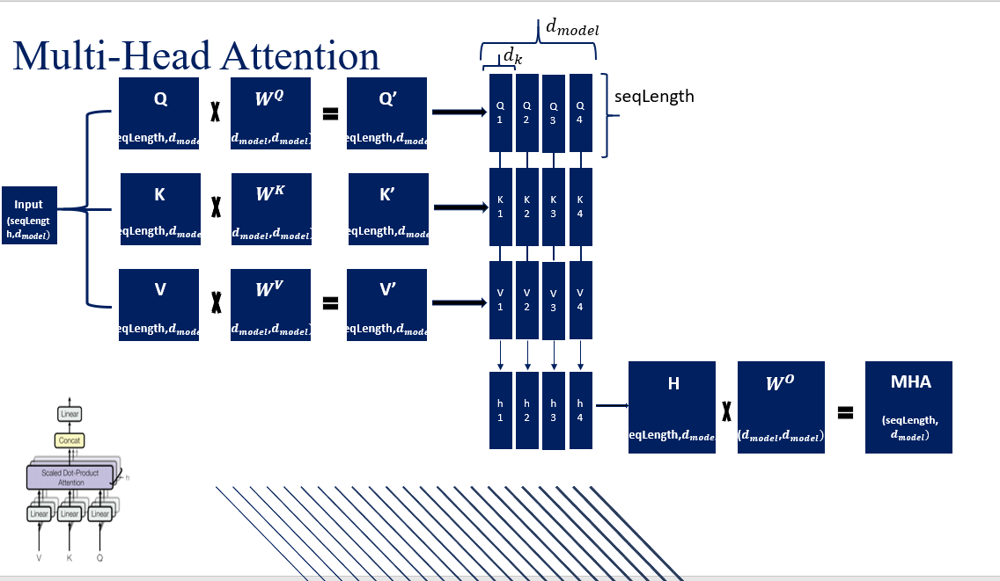
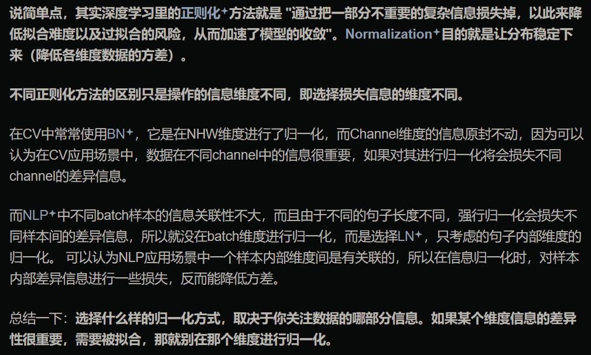

1. Q：详细说一下 Decoder 的因果注意力 Q、K、V 分别来自哪  
A：因果关系改进主要是防止模型访问序列中的未来信息。
在 Transformer 的自回归任务中，每个词的预测只能依赖于之前的词。与标准自注意力允许访问整个输入序列不同，
因果自注意力会遮蔽序列中当前位置之后的输入，限制模型在计算注意力得分时，只能访问当前位置及之前的 token，因此也被称为遮蔽注意力（masked attention）
Decoder 的因果注意力中，O、K、V 均来自输出序列  
  
</br>  
2. Q：Attention 为什么要做 scaled？不做会怎么样？为什么要除以 $\sqrt{d_k}$？  
A：假设向量 $q$ 和 $k$ 的各个分量是互相独立的随机变量，均值为 0，方差为 1，那么点积 $q \cdot k$ 的均值为 0，方差为 $d_k$。所以当 $d_k$ 变大时意味着 $q \cdot k$ 的方差变大，从而导致对 softmax 函数求导时出现梯度消失的问题。除以 $\sqrt{d_k}$ 实际上是将 $q \cdot k$ 的方差控制为 1，从而有效避免梯度消失的问题  
更具体的回答见：https://www.zhihu.com/question/339723385/answer/811341890  
softmax 求导的公式推导：https://mingchao.wang/CPxjCCZa/
</br>
3. 多头注意力（这里以自注意力为例，Q、K、V 同源）
- 序列长度 $n$
- 词向量维度 $d$
- 头数 $h$
- 每个头的维度 $d_k$
时间复杂度：$O(n^2d)$
空间复杂度：$O(n^2+nd)$ ≈ $O(n^2)$
多头(自)注意力的流程：
- 为输入序列中的每个元素计算 Q, K, V, 这是通过将输入此向量与三个权重矩阵相乘实现的：$$ Q = x W_{q} \ K = x W_{k} \ V = x W_{v} $$ 其中，$x$ 是输入词向量，$W_q$, $W_k$ 和 $W_v$ 是 Q, K, V 的权重矩阵
- 计算 Q, K 注意力得分：$\operatorname{score}(Q, K)=\frac{Q \cdot K^{T}}{\sqrt{d_{k}}}$，其中，$d_k$ = $d_{model} / k$
- 使用softmax得到注意力权重：$\operatorname{Attention}(Q, K)=\operatorname{softmax}(\operatorname{score}(Q, K))$
- 使用注意力权重和v，计算输出：$Output =\operatorname{Attention}(Q, K) \cdot V$
- 拼接多头输出，乘以 $W_O$，得到最终输出：$MultiHeadOutput = Concat \left(\right. Output ^{1}, Output ^{2}, \ldots, Output \left.^{H}\right) W_{O}$
  
代码实现：
```python
class MultiHeadAttentionBlock(nn.Module):

    def __init__(self, d_model: int, h: int, dropout: float) -> None:
        super().__init__()
        self.d_model = d_model # Embedding vector size
        self.h = h # Number of heads
        # Make sure d_model is divisible by h
        assert d_model % h == 0, "d_model is not divisible by h"

        self.d_k = d_model // h # Dimension of vector seen by each head
        self.w_q = nn.Linear(d_model, d_model, bias=False) # Wq
        self.w_k = nn.Linear(d_model, d_model, bias=False) # Wk
        self.w_v = nn.Linear(d_model, d_model, bias=False) # Wv
        self.w_o = nn.Linear(d_model, d_model, bias=False) # Wo
        self.dropout = nn.Dropout(dropout)

    @staticmethod
    def attention(query, key, value, mask, dropout: nn.Dropout):
        d_k = query.shape[-1]
        # Just apply the formula from the paper
        # (batch, h, seq_len, d_k) --> (batch, h, seq_len, seq_len)
        attention_scores = (query @ key.transpose(-2, -1)) / math.sqrt(d_k)
        if mask is not None:
            # Write a very low value (indicating -inf) to the positions where mask == 0
            attention_scores.masked_fill_(mask == 0, -1e9)
        attention_scores = attention_scores.softmax(dim=-1) # (batch, h, seq_len, seq_len) # Apply softmax
        if dropout is not None:
            attention_scores = dropout(attention_scores)
        # (batch, h, seq_len, seq_len) --> (batch, h, seq_len, d_k)
        # return attention scores which can be used for visualization
        return (attention_scores @ value), attention_scores

    def forward(self, q, k, v, mask):
        query = self.w_q(q) # (batch, seq_len, d_model) --> (batch, seq_len, d_model)
        key = self.w_k(k) # (batch, seq_len, d_model) --> (batch, seq_len, d_model)
        value = self.w_v(v) # (batch, seq_len, d_model) --> (batch, seq_len, d_model)

        # (batch, seq_len, d_model) --> (batch, seq_len, h, d_k) --> (batch, h, seq_len, d_k)
        query = query.view(query.shape[0], query.shape[1], self.h, self.d_k).transpose(1, 2)
        key = key.view(key.shape[0], key.shape[1], self.h, self.d_k).transpose(1, 2)
        value = value.view(value.shape[0], value.shape[1], self.h, self.d_k).transpose(1, 2)

        # Calculate attention
        x, self.attention_scores = MultiHeadAttentionBlock.attention(query, key, value, mask, self.dropout)
        
        # Combine all the heads together
        # (batch, h, seq_len, d_k) --> (batch, seq_len, h, d_k) --> (batch, seq_len, d_model)
        x = x.transpose(1, 2).contiguous().view(x.shape[0], -1, self.h * self.d_k)

        # Multiply by Wo
        # (batch, seq_len, d_model) --> (batch, seq_len, d_model)  
        return self.w_o(x)
```
4. 各种归一化：https://zhuanlan.zhihu.com/p/86765356
5. 为什么 Transformer 中使用 layer normalization？
     
</br> 
6. $$ \operatorname{FFN}{\text {SwiGLU }}\left(\boldsymbol{x}, \boldsymbol{W}, \boldsymbol{V}, \boldsymbol{W}{2}\right)=\operatorname{SwiGLU}(\boldsymbol{x}, \boldsymbol{W}, \boldsymbol{V}) \boldsymbol{W}_{2} $$