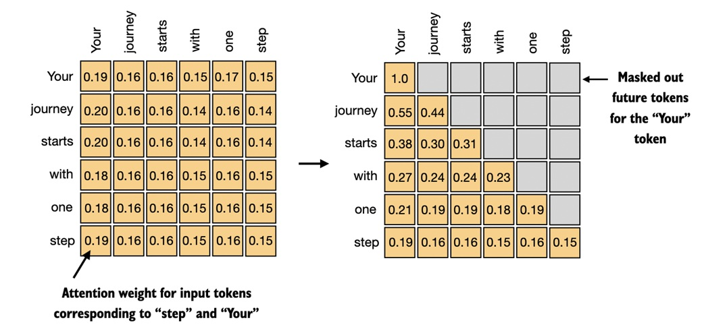

1. Q：详细说一下 Decoder 的因果注意力 Q、K、V 分别来自哪  
A：因果关系改进主要是防止模型访问序列中的未来信息。
在 Transformer 的自回归任务中，每个词的预测只能依赖于之前的词。与标准自注意力允许访问整个输入序列不同，
因果自注意力会遮蔽序列中当前位置之后的输入，限制模型在计算注意力得分时，只能访问当前位置及之前的 token，因此也被称为遮蔽注意力（masked attention）
Decoder 的因果注意力中，O、K、V 均来自输出序列  
  
   
2. Q：Attention 为什么要做 scaled？不做会怎么样？为什么要除以 $\sqrt{d_k}$？  
A：
3. 