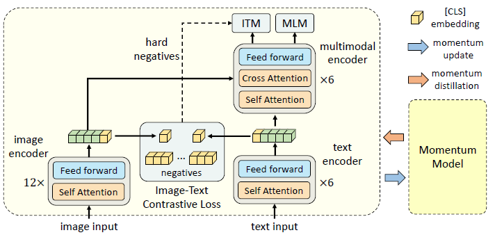
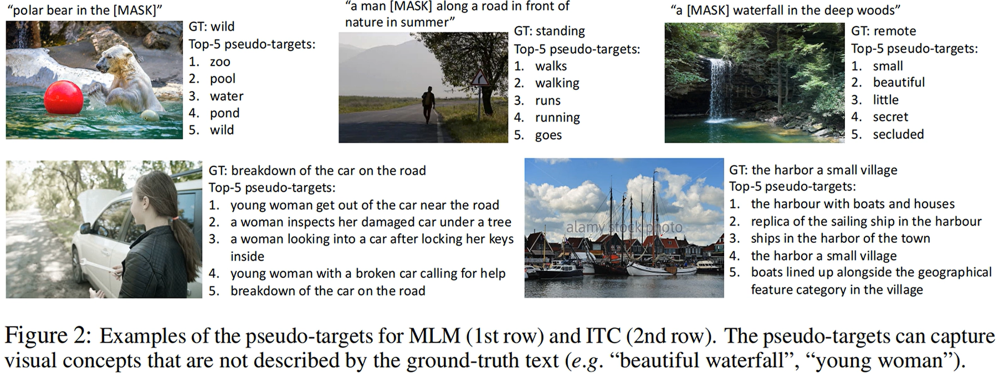

# Align before Fuse: Vision and Language Representation Learning with Momentum Distillation

### 多模态学习中较好的模型结构应当满足：
#### 1、图像和文本各自用不同的编码器先分别进行编码，然后再进行多模态融合
#### 2、图像编码器的网络规模应当大于文本编码器，这一点在 CLIP 中得到过验证，即增加视觉部分的网络大小，模型的精度会有所提升，增加文本部分的网络大小，模型的精度变化不大
#### 3、融合编码器不能太简单

### ALBEF 的模型架构
 
#### 左边为图像编码器，采用 ViT 结构，层数大于文本编码器
#### 右边为文本编码器，采用 Bert 结构
#### 每个编码器都有一个 [CLS] token 来提取图片和文本特征
#### 通过图像和文本特征的对比学习对齐图像和文本的特征表示
#### ALBEF 沿用了 MOCO 的思想，增加了动量模型（既有图像 Encoder 的参数，也有文本 Encoder 的参数），这使得动量模型能够通过队列给图像和文本分别提供一致且多的负例。训练模型生成的图像向量和动量模型的文本队列进行对比，训练模型生成的文本向量和动量模型的图像队列进行对比
#### 多模态融合部分的 cross-attention 中的 q 来自文本编码器，k 和 v 来自图像编码器
#### 使用 ITM（图文匹配）和 MLM 任务可以充分地进行多模态融合

### 何谓“动量蒸馏”？
#### 图文对都是在互联网采集的，这些图文对不一定非常匹配，利用这些数据构造的带掩码的语言模型会有什么问题呢？
 
#### 模型预测的伪标签能够捕捉到 gt 文本中没有描述到的视觉信息，也就是说伪标签在某种程度上比 gt 还要准确。如果用 one-hot 标签去调整模型，反而会削弱性能
#### 动量蒸馏做的事：计算 loss 时，不光考虑采集数据中的标准答案，还考虑训练模型和动量模型输出的分布差异
