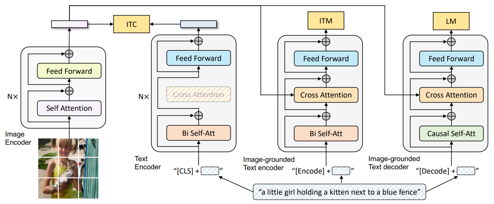
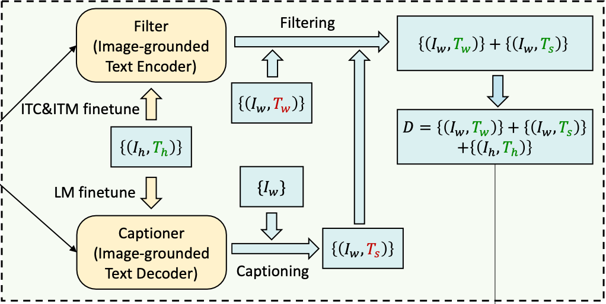

# BLIP: Bootstrapping Language-Image Pre-training for Unified Vision-Language Understanding and Generation（通过自举方式预训练的语言-图像模型，统一视觉-文本的理解和生成）
## 解决了两个问题：
### 问题一：训练一个模型即可以做检索又可以做生成
### 问题二：解决网络收集图文对数据中的噪声问题

 
### BLIP 如何做到既可以检索又可以生成？
#### 引入编码器-解码器的多模态混合结构 MED，包括两个单模态编码器（lmage Encoder，Text Encoder），一个以图像为基础的编码器（image-grounded text encoder）和一个以图像为基础的解码器（image-grounded text decoder），三者共享一部分参数
#### 通过三个损失函数联合进行预训练：
#### (i) 图像-文本对比损失 ITC（Image-Text Contrastive Loss）：对齐图像和文本的潜在特征空间
#### (ii) 图像-文本匹配损失 ITM（Image-Text Matching Loss）：针对以图像为基础的文本编码器，通过对图文匹配性进行二分类，建模图文多模态信息的相关性
注：ITM 对应二分类任务，判断图文是否匹配，输入的文本中添加了一个可学习的 [Encode] token 来提取多模态的融合特征
#### (iii) 语言建模损失 LM（Language Modeling Loss）：针对以图像为基础的文本解码器，通过交叉熵损失进行优化，训练模型以自回归的方式生成目标caption
 
### BLIP 如何解决网络收集图文对数据中的噪声问题？
#### Captioning and Filtering 模块

#### 训练模型的数据包含两部分：
#### $(I_w, T_w)$：从网络采集的图文对，质量较差
#### $(I_h, T_h)$：人工标注的图文对，质量较好
#### (i) 用以上两部分数据预训练一个 BLIP 模型
#### (ii) 用 ITC 和 ITM 任务在 $(I_h, T_h)$ 数据集上训练一个 Filter 模型，用 LM 任务在 $(I_h, T_h)$ 数据集上训练一个 Captioner 模型
#### (iii) 对来自网络的图片通过 Captioner 生成对应文本 $T_s$，仅保留 Filter 判断匹配的图文对。过滤后的数据包含三部分：1、判断图文匹配的网络文本对；2、判断图文匹配的网络图片+Captioner生成的文本对；3、原始的人工标注的图文对
#### (iiii) 将过滤后的一组数据作为训练数据，重新训练一个 BLIP 模型（参数需重新初始化）