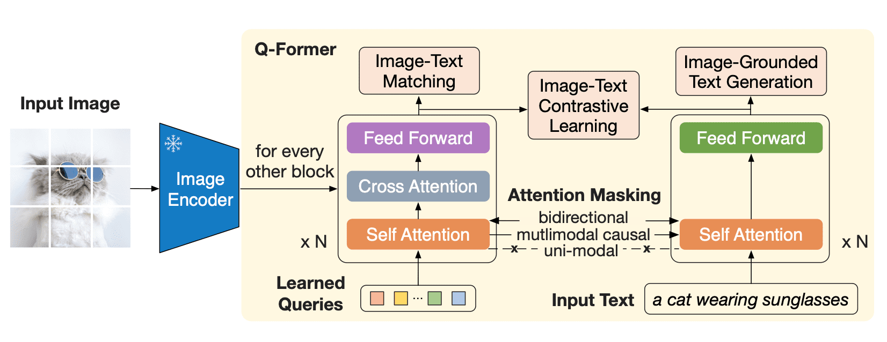
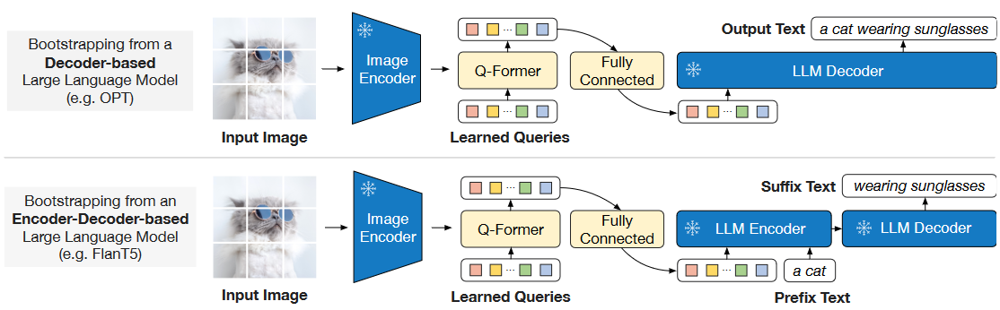

# BLIP-2: Bootstrapping Language-Image Pre-training with Frozen Image Encoders and Large Language Models（通过冻结图像编码器和大语言模型进行语言-图像预训练的自举方法）
## 动机
### 1、利用预训练的视觉模型和大语言模型来构造一个多模态大模型，而非从头开始训练
### 2、在做多模态大模型的生成任务之前先对多模态特征进行对齐和融合
## 方法
### 通过一个桥接模型连接冻结的视觉编码器和大语言模型
### 两阶段学习：
### 1、视觉语言表示学习，进行文本和视觉特征的对齐融合
### 2、基于图像的语言生成学习，训练模型的多模态生成能力
## 结构
### Q-Former (Image Transformer + Text Transformer)
 
#### Image Transformer 和 Text Transformer 的 Self Attention 和 Feed Forward 层均由预训练的 Bert 初始化
#### Image Transformer 的 Cross Attention 层随机初始化
#### Image Transformer 和 Text Transformer 共享 Self Attention 层
#### Image Transformer 的输入为 32 个维度为 768 的可学习 embedding。其通过 Cross Attention 层从图像编码器获取图像信息。Cross Attention 层的 Query 来自 32 个 Query Token，Key 和 Value 来自图像编码器。最终输出 32 个维度为 768 的视觉特征
#### Text Transformer 是一个标准的 Bert 结构
### BLIP2 训练的第一个阶段：视觉语言表示学习（ITC 任务）
 
#### 图片通过图像编码器转换为图像特征，Image Transformer 通过 Cross Attention 将这些特征转化为 32 个 768 维的加工后的图像特征
#### 文本侧在最前面加一个可学习的 [CLS] Token，取最后一层的 [CLS] Token 输出作为文本表示
#### 将 Image Transformer 的 32 个输出，每一个都和文本侧输出的 [CLS] Token 计算相似度，并从中选择相似度最高的一个最终计算对比损失
#### 在这一阶段，32 个 Query Token 和 输入的文本 Token 各自进行 Self Attention，彼此之间并无注意力交互
### BLIP2 训练的第一个阶段：图文匹配任务（ITM 任务） 
#### 因为图文匹配任务需要融合图像和文本两种模态的特征，所以这个阶段 Query Token 和文本 Token 在做自注意力时是可以互相看到的
### BLIP2 训练的第一个阶段：图像文本生成任务（ITG 任务）
#### Query Token 看不到文本 Token，文本 Token 可以看到所有的 Query Token 以及自己前面的文本 Token（因为是文本生成任务，所以看不到自己后面的 Token）
### BLIP2 训练的第二个阶段：基于图像的语言生成任务
 
