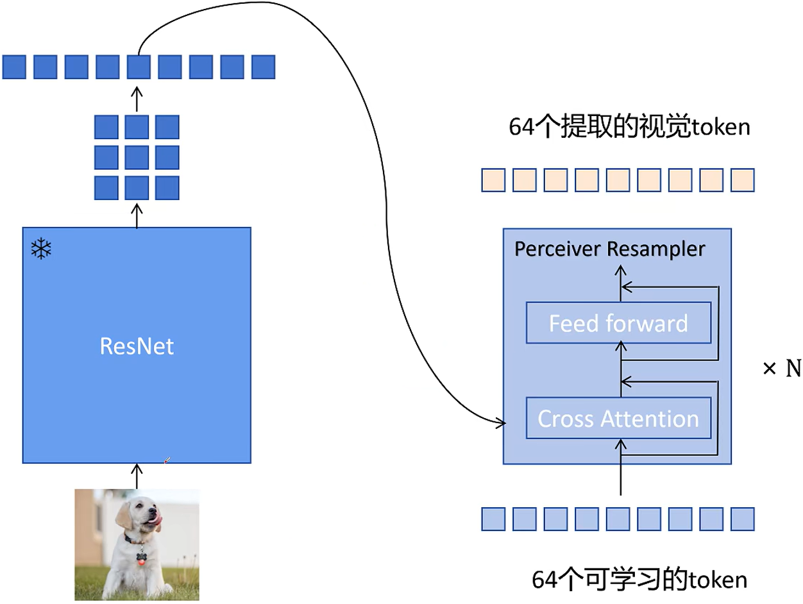

# Flamingo: a Visual Language Model for Few-shot Learning 一个少样本学习的视觉-语言模型
## 动机
### 做出多模态领域的一个 few-shot learning 的模型
### 可以利用已经训练好的视觉模型和大语言模型（避免从头开始训练，节约训练成本）
 
#### 输入：图文混合输入。狗的图片+对应文字描述；猫的图片，希望模型能够继续生成对猫的图片的描述
#### 模型组成：
#### Vision Encoder，预训练的视觉编码器，训练时被冻结；
#### Perceiver Resampler，将变化大小的图片/视频特征转化为固定大小的喂给大语言模型的视觉特征；
#### Gated Cross-Attention Dense，门控交叉注意力和全连接层，让文本从视觉中获取信息；
#### LM Block 大语言模型模块
#### 提取视觉特征
 
#### 图片 $\longrightarrow$ 预训练 ResNet $\longrightarrow$ 2d 特征图 $\longrightarrow$ 展平为一维序列特征

