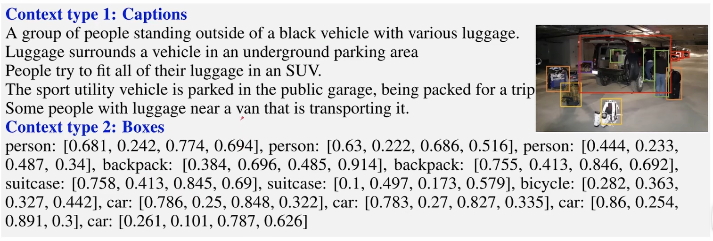
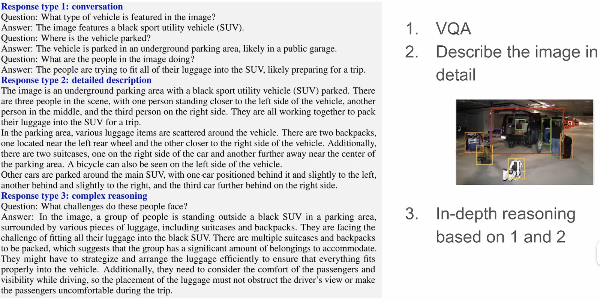
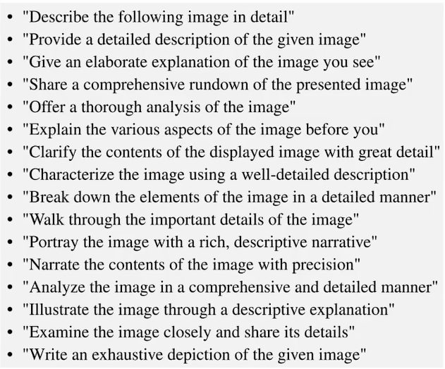

## LLaVA
### 背景
#### 现有的图像-文本对数据集，图像和文本的联系相对较浅。如果想让模型挖掘图像和文本之间更加深层的联系，现有数据集的质量很难满足
### 解决方案
#### 基于现有的大语言模型提升文本数据的质量
### 已有数据集
#### 提供：Captions + Bounding boxes

#### 需要通过 LLM 为我们生成什么样的文本数据？
#### 1、对话（一问一答形式）；2、更详细的描述；3、深入的推理

#### 如何去 Prompt?
#### 对于第一个任务：提的问题需要有水平
#### 对于第二个任务，利用以下 prompt 要求 GPT 描述图像内容：
 