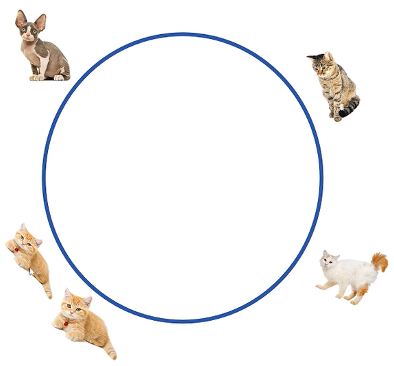
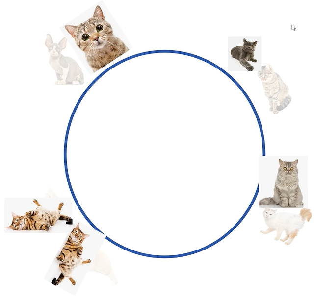
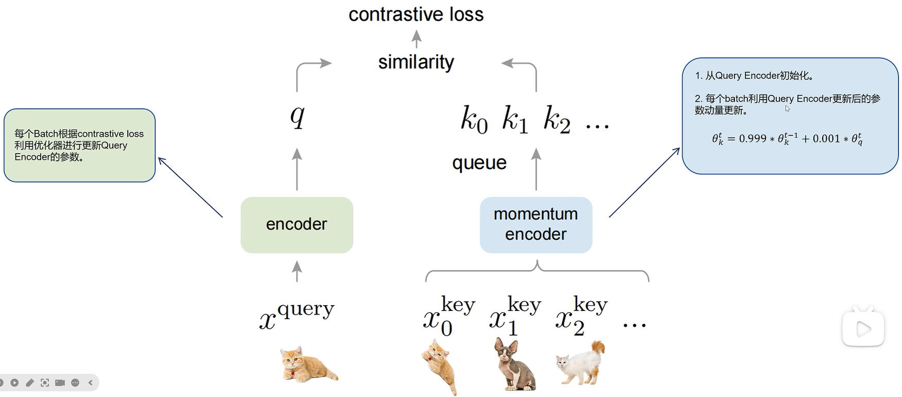

# Momentum Contrast for Unsupervised Visual Representation Learning

### 对比学习中 batch size 过小带来的问题
#### 例如一个 batch 当中存在一个正样本对和三个负样本对：
 
#### 假设向量空间是圆，正负样本的向量都被分配到了合适的位置上
#### 对于下一个 batch 的数据，模型可以很好地区分正负样本，但此时模型看不到上一个 batch 的样本，模型分配的向量位置可能和上一个 batch 分配的向量位置重合，让原本不是正样本对的两个样本距离很近：
 
#### 有一种办法：记录之前 batch 中的特征向量，这些向量不记录梯度，不会通过反向传播优化 loss，只是为了让模型更好地分配向量位置
#### 会带来什么问题？随着训练的进行，模型一直在变化，每个 batch 生成特征向量的模型是不同的，不能拿过去模型生成的向量来调整现在的模型
### 对比学习效果好的两个要求：
#### 1、负例要尽可能多
#### 2、负例要尽可能一致

 
#### MOCO 将对比学习看作一个字典检索问题，每次有一个样本称为 query，字典里有一个正样本，其他都是负样本
#### 对比学习的任务是根据一个 query 从一大堆 key 中找到唯一一个正样本的 key
#### MOCO 里有一个队列，存储大量负样本的 key，每个 batch 都会给该队列增加负样本的 key
### MOCO 如何解决模型随 batch 变化而带来的问题？
#### MOCO 中队列里负样本的特征向量都是通过动量模型生成的，跟随 query 模型变化的趋势，又保证了跨 batch 之间特性向量的变化不至于太大，这样队列里保存的负样本就是又多又一致了