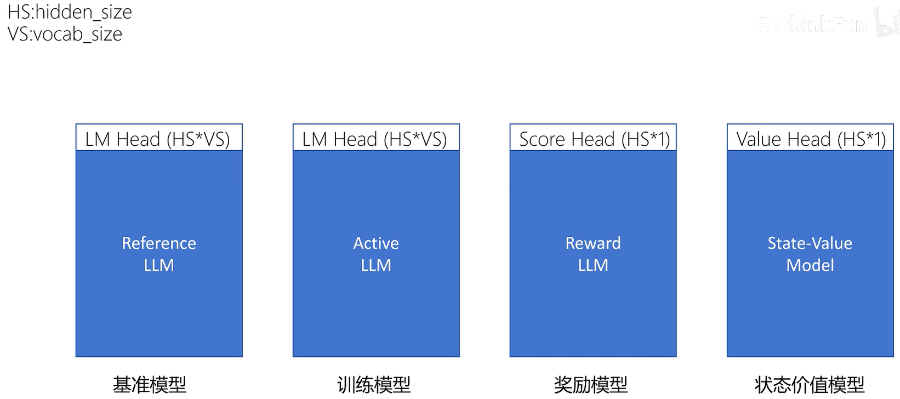
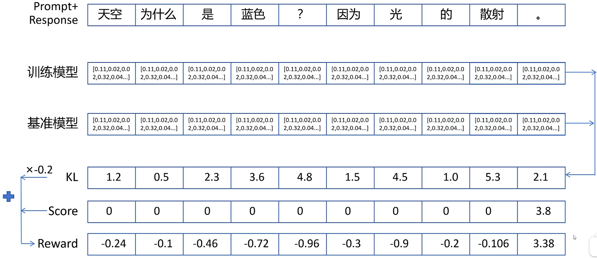
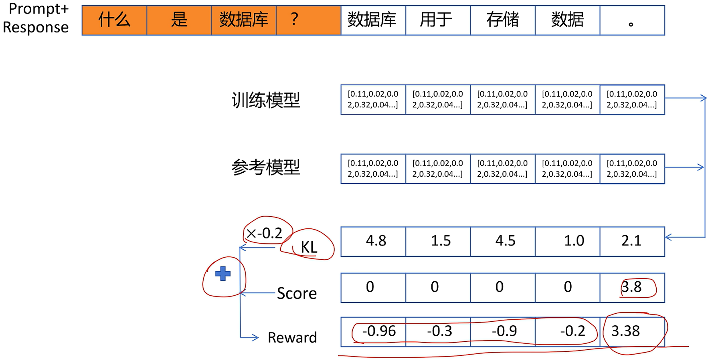

每一个 action 的 return 都只累加它后面的 reward 并且逐步衰减  
但这也是通过具体采样得到的值，采样存在的问题是需要无限多次的采样才能准确反映当前 action 的好坏
如果只采样一个 Trajectory，方差大，训练不稳定  
需要一个函数估计 action 可以得到的 return 的期望
这个函数就是动作价值函数（Action-Value Function），记为 $Q_\theta(s, a)$，反映在 state $s$ 下做出 action $a$ 期望的回报

#### 大模型强化学习 + PPO 算法
##### Q：用于大模型训练的什么阶段？
##### A：监督微调之后
PPO 算法需要一个预先训练的 reward 模型来为模型的输出进行打分提供奖励信号
怎么训练一个 reward 模型呢？  
首先是需要的数据 —— 偏好数据（对同一个问题的两个答案的比较数据）  
好的回答：chosen；不好的回答：rejected

训练 PPO 需要 4 个模型：  
1、基准模型（Reference Model）：SFT 之后的大模型，新训练模型输出的概率分布不能和基准模型相差太大  
2、训练模型（Active Model）：结构和基准模型完全一致，PPO 的目的是优化训练模型，训练模型输出的概率分布不能和基准模型相差太大   
3、奖励模型（Reward Model）：对一个问答序列进行评分，输出一个分数  
4、状态价值模型（State-Value Model）：对每一个状态评估其价值，根据截至目前的 Token 序列，预测到序列生成结束后，这个问答序列的期望回报是多少（需要对每个 Token 都输出）

对于大模型输出的每一步而言，state：截止到当前 Token 的序列；action：接下来输出的 Token；大模型：策略函数
对于 Reward Model 来说，score 只给最后一个 Token
训练模型做出每一个 actioon，即输出每一个 Token 的 Reward 等于其输出 Token 的概率分布与基准模型输出 Token 的概率分布间的 KL 散度 * -0.2

最后一个 Token 的 reward 的值是有意义的，其他 Token 的 reward 值只是用来限制新的模型不能和原来的模型差别太大

#### PPO 算法是如何计算每个 Token 的 GAE 优势值的？
为每个 Token 生成 reward 值 $\Rightarrow$ 用这些 reward 值训练 State-Value Model $\Rightarrow$ 利用每个 token 的 reward 值和状态价值共同训练出 GAE 的值
基础监督信号都来自每个 Token 的 reward，然而每个 Token 的 reward 值并不准确。所以 PPO 算法不太适合大模型生成任务，因为只能对最终输出给出一个奖励值，而无法对每一个 Token 给出具有参考价值的奖励值